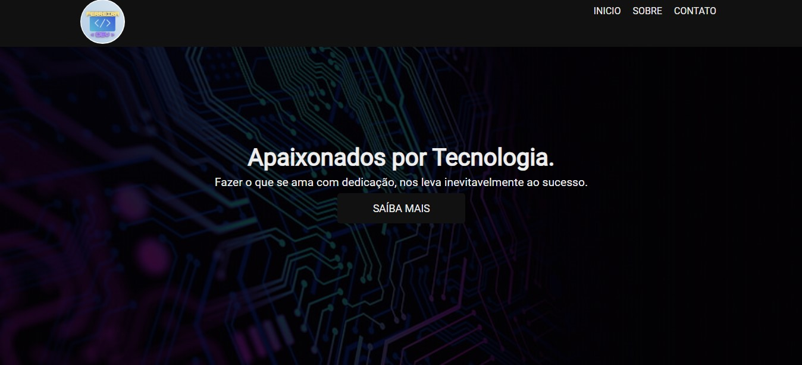

  

<h1 align="center">FERREIRA-DEV</h1>

Projeto desenvolvido para divulgação dos serviços de desenvolvimento e manutenção de Notebooks e Desktops.

 

|
  <a href="#-tecnologias">Tecnologias</a> |
  <a href="#-projeto">Projeto</a> | 
  <a href="#-layout">Layout</a> | 
  <a href="#memo-licença">Licença</a> | 

  

 

## 📖 Tecnologias

Esse projeto foi desenvolvido com  as seguintes tecnologias:

- HTML e CSS3
- JAVASCRIPT
- GIT e GITHUB
 
 

## 💻 Projeto

O Site foi baseado na vídeo aula de um canal no You Tube, segue abaixo link.

 

## 📐 Layout

Você pode visualizar o vídeo desse projeto através [DESSE LINK](https://www.youtube.com/watch?v=G4_QjTJTVlc&list=PLtBZKYFMnG8IdT8Jip0kS1eUnl3I6hY-e&index=6).

 

## :memo: Licença

Esse projeto está sob a licença MIT.

 
 
 

---
Feito com ❤ por Robson :wave: